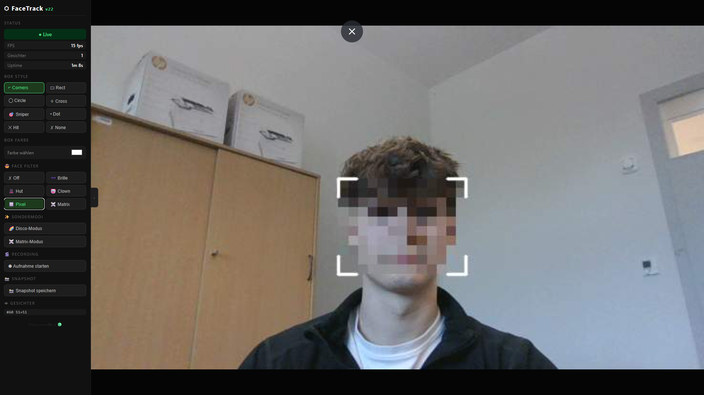

# FaceTracker 🖥️📹

**Real-time Gesichtserkennung & Tracking mit OpenCV + Flask Web-Interface**


## 🚀 Features
- 🎥 Live-Camera-Stream mit Face-Detection
- ⚡ OpenCV-basierte Gesichts-Tracking (MediaPipe optional)
- 🖥️ Responsive Flask Web-Interface
- 📊 Performance-Monitoring (Prometheus)
- 🔧 Konfigurierbar via `.env`
- 

## 📋 Voraussetzungen
- Python 3.9+
- OpenCV 4.8+
- Raspberry Pi 4/5 (empfohlen) oder PC
- Webcam/USB-Kamera

## 🛠️ Installation

### Raspberry Pi (empfohlen)
```bash
sudo apt update && sudo apt install -y python3-opencv python3-numpy python3-pil
git clone https://github.com/realCornball04/facetracker.git
cd facetracker
python3 -m venv venv
source venv/bin/activate
pip install flask flask-cors python-dotenv prometheus-client werkzeug scipy
